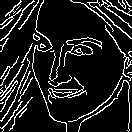
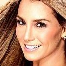
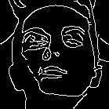
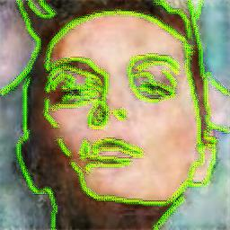

# Draw_the_criminal
Este proyecto fue originalmente creado para participar en el reto #RetoDotCSV2080Super y posteriormente se continuara la mejoría para hacer una aportación a la sociedad

Introducción: La idea surge a partir de el robo de celulares, un delito bastante común, por lo menos en México, donde la forma de proceder es hacer una denuncia en linea y entregarla a las autoridades, la denuncia es una breve descripción de los hechos, la hora, lugar, etc. etc. y a pesar de que existen camaras en el transporte publico, pareciera que no hay nada que se pueda hacer, la propuesta es permitir a los afectados, dibujar, a grandes rasgos como luce la persona que cometió el delito (en este punto se generaliza, asaltos, robos, vandalismo, etc) y a partir de ese bosquejo, se genera una imagen realista que tendría algún parecido a la persona que se describe, para facilitar su búsqueda, identificación e investigación.

Hacer una denuncia es algo parecido a lo siguiente.

En este repositorio hay únicamente la parte del modelo propuesto para generar las imágenes a partir de el bosquejo de las denuncias.

El dataset usado tiene por nombre CelebA, se puede consultar aquí http://mmlab.ie.cuhk.edu.hk/projects/CelebA.html El dataset contiene casi 200'000 imágenes, por temas de recursos y tiempo, se usaron solo mil de estas Se descargo el archivo del dataset de nombre img_align_celeba, que contiene imágenes con caras centradas y se recorto la parte de la cara. (para esto se uso el siguiente script de bash).

for x in $(ls img_align_celeba | head -n 1000); do python3 face_cropper_crop.py $x ; done

El resultado fue el siguiente:

Imagen antes del proceso:

  Imagen original 
  

Imagen despues del proceso:

  Imagen recortada 
  

Preparación del dataset:Se uso un pequeño programa de python que hace uso de OpenCV para aplicar un tratamiento a las imágenes, y fue ejecutado a través de un ciclo de bash. El procesamiento consistió en detectar los bordes de las caras,para así simular un bosquejo de las caras y evitar hacerlo a mano.

for x in $(ls img_align_celeba | head -n 1000); do python3 face_cropper_border.py $x ; done

El resultado fue el siguiente:

  Bordes de la imagen 
  
  

Posteriormente se hiceron pequenos cambios al código propuesto por DOTCSV en su video (https://www.youtube.com/watch?v=YsrMGcgfETY&t=2691s) y se comenzó el entrenamiento, a continuación se presentan los resultados

  Imagen generada 
  
  
  

Ejemplos de la evolucion del Modelo

  Ejemplo 1 
  

